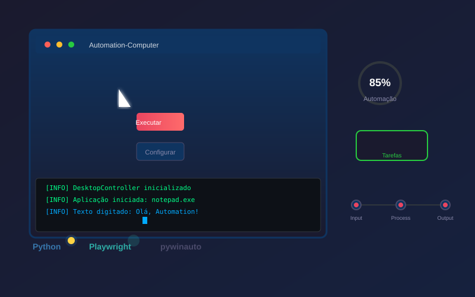
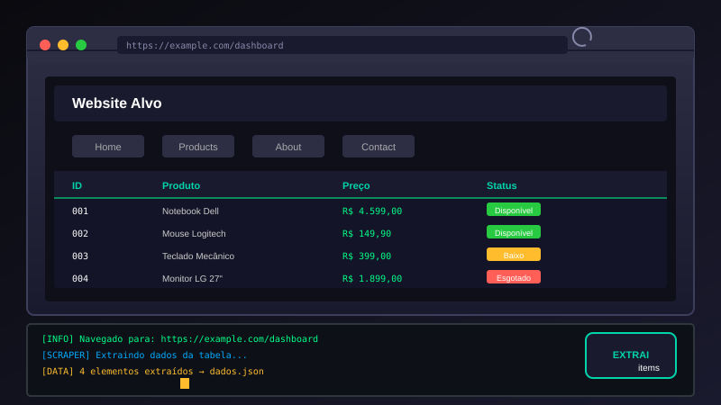
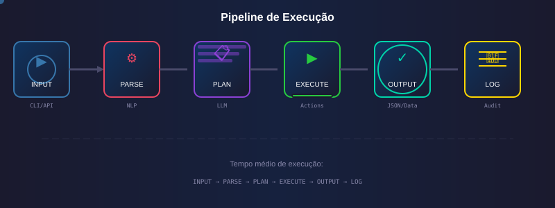

# Automation-Computer

[](https://opensource.org/licenses/MIT)
[](https://www.python.org/downloads/)
[](https://github.com/psf/black)
[]()
[](GOVERNANCA_LGPD.md)

---

Sistema avançado de **RPA (Robotic Process Automation)** com integração de IA para automação inteligente de tarefas computacionais, desenvolvido com foco em segurança, ética e conformidade com a LGPD.

---

## 🎬 Demo Visual

### Automação Desktop em Ação



*Controle completo de mouse, teclado e janelas Windows com pywinauto + pynput*

---

### Web Scraping Automatizado



*Extração de dados estruturados de websites usando Playwright*

---

### Processamento com IA



*Orquestração multi-provider: Claude, GPT-4, Ollama (local)*

---

### Segurança e Criptografia



*Fernet (AES-128), bcrypt, rate limiting, sandboxing e auditoria completa*

---

## 🏗️ Arquitetura do Sistema



---

## ⚡ Pipeline de Execução



---

## 🚀 Funcionalidades

### Automação Desktop
| Feature | Descrição |
|---------|-----------|
| 🖱️ Mouse | Click, move, scroll em coordenadas |
| ⌨️ Teclado | Digitação e atalhos (Ctrl+C, Ctrl+V, etc.) |
| 🪟 Janelas | Start, connect, minimize, maximize, close |
| 🎯 Elementos | Detecção por ID, título, imagem |

### Automação Web
| Feature | Descrição |
|---------|-----------|
| 🌐 Navegação | Chromium, Firefox, WebKit |
| 📝 Formulários | Fill, type, select, submit |
| 📊 Scraping | Extract data, tables, lists |
| 📸 Screenshots | Full page ou região |

### Integração com IA
| Feature | Descrição |
|---------|-----------|
| 🤖 LLMs | Claude, GPT-4, Ollama (fallback) |
| 📋 Planos | Geração automática de tarefas |
| 💬 Chat | Contexto persistente |
| 🧠 Visão | MediaPipe, YOLO (em desenvolvimento) |

### Segurança e Governança
| Feature | Descrição |
|---------|-----------|
| 🔐 Criptografia | Fernet AES-128 + bcrypt |
| 🛡️ Sandbox | Paths e domains whitelist |
| 📊 Rate Limit | 60 req/min + burst control |
| 📝 Auditoria | Logs JSON completos |
| ✅ LGPD | 10 princípios implementados |

---

## 📁 Estrutura do Projeto

```
Automation-Computer/
├── src/
│   ├── automation/
│   │   ├── desktop_controller.py   # pywinauto + pynput
│   │   ├── web_automation.py       # Playwright async
│   │   ├── screenshot_ocr.py       # Captura + OCR
│   │   └── keyboard_mouse.py       # Input handling
│   ├── security/
│   │   ├── encryption.py           # Fernet, bcrypt
│   │   ├── rate_limiter.py         # Rate limiting
│   │   ├── sandbox.py              # Sandboxing
│   │   └── auditor.py              # Audit logs
│   ├── ai/
│   │   ├── llm_orchestrator.py     # Multi-provider LLM
│   │   ├── vision_analyzer.py      # Computer vision
│   │   └── decision_engine.py      # Decision engine
│   ├── ui/
│   │   ├── cli.py                  # Typer + Rich CLI
│   │   ├── dashboard.py            # FastAPI + React
│   │   └── voice_interface.py      # Speech recognition
│   └── utils/
│       ├── config.py               # Config management
│       ├── logger.py               # Centralized logging
│       └── helpers.py              # Utility functions
├── tests/
├── docs/
├── examples/
├── assets/                    # SVGs animados
├── .github/workflows/ci.yml   # CI/CD
├── requirements.txt
├── pyproject.toml
└── README.md
```

---

## 🛠️ Instalação

### Windows (Recomendado)

```powershell
# Clonar repositório
git clone https://github.com/Lelolima/Automation-Computer.git
cd Automation-Computer

# Criar ambiente virtual
python -m venv venv
.\venv\Scripts\Activate.ps1

# Instalar dependências
pip install -r requirements.txt

# Instalar Playwright browsers
playwright install

# Executar CLI
python -m src.ui.cli
```

### Linux/macOS

```bash
git clone https://github.com/Lelolima/Automation-Computer.git
cd Automation-Computer
python -m venv venv
source venv/bin/activate
pip install -r requirements.txt
playwright install
python -m src.ui.cli
```

### Validação Pós-Instalação

```bash
# Rodar script de validação
python validate_fixes.py

# Rodar testes
pytest tests/ -v
```

---

## 💡 Uso Básico

### CLI Interativa

```bash
# Ver status do sistema
python -m src.ui.cli status

# Hello World
python -m src.ui.cli hello "Seu Nome"

# Versão
python -m src.ui.cli version
```

### API Python - Desktop

```python
from src.automation.desktop_controller import DesktopController

# Inicializar
desktop = DesktopController()

# Abrir aplicação
desktop.start_app("notepad.exe")

# Digitar
desktop.type_text("Olá, Automation-Computer!")

# Atalhos
desktop.press_key("ctrl_a")  # Selecionar tudo
desktop.press_key("ctrl_c")  # Copiar
desktop.press_key("ctrl_v")  # Colar

# Click em coordenadas
desktop.click(x=100, y=200)

# Gerenciar janelas
desktop.minimize_window("notepad.exe")
desktop.maximize_window("notepad.exe")
desktop.close_window("notepad.exe")
```

### API Python - Web

```python
import asyncio
from src.automation.web_automation import WebAutomation

async def main():
    async with WebAutomation(headless=True) as browser:
        # Navegar
        await browser.navigate("https://example.com")

        # Preencher formulário
        await browser.fill("#email", "teste@email.com")
        await browser.fill("#password", "senha123")
        await browser.click("#login")

        # Aguardar elemento
        await browser.wait_for_selector(".dashboard")

        # Extrair dados
        title = await browser.get_text("h1")
        items = await browser.extract_all(".item")

        # Screenshot
        await browser.screenshot("result.png")

asyncio.run(main())
```

### API Python - IA

```python
from src.ai.llm_orchestrator import LLMOrchestrator

llm = LLMOrchestrator(
    primary_provider="anthropic",
    fallback_providers=["openai", "ollama"]
)

# Gerar plano de automação
plano = await llm.generate_plan(
    "Abra o bloco de notas, digite um relatório e salve"
)

# Chat com contexto
resposta = await llm.chat(
    "Como faço web scraping de tabelas?",
    system="Você é um assistente de automação"
)
```

### Exemplos Completos

```bash
# Desktop automation
python examples/basic_automation.py

# Web scraping
python examples/web_scraping.py

# IA assisted
python examples/ai_assisted.py
```

---

## 🔒 Segurança

O projeto foi desenvolvido com segurança como prioridade máxima:

| Princípio | Implementação |
|-----------|---------------|
| 🔐 **Criptografia** | Fernet (AES-128) para dados em repouso |
| 🔑 **Senhas** | bcrypt com salt aleatório |
| 🛡️ **Sandboxing** | Paths e domains com whitelist |
| 📊 **Rate Limiting** | 60 req/min + burst de 10 |
| 📝 **Auditoria** | Todas ações logadas em JSON |
| ✅ **LGPD** | 10 princípios conformes |

### Exemplo: Criptografia

```python
from src.security import EncryptionService

# Criptografar dado sensível
enc = EncryptionService()
segredo = enc.encrypt("minha_senha_secreta")
descriptografado = enc.decrypt(segredo)

# Hash de senha
from src.security import PasswordService
hashed = PasswordService.hash_password("senha123")
valido = PasswordService.verify_password("senha123", hashed)
```

### Exemplo: Auditoria

```python
from src.security import Auditor

auditor = Auditor(log_path="audit.json")

# Logar ação
auditor.log_action(
    action="click_window_element",
    agent="usuario123",
    details={"element": "btn_submit"},
    success=True
)

# Salvar e consultar
auditor.save_logs()
logs = auditor.get_logs(agent="usuario123")
```

Consulte `GOVERNANCA_LGPD.md` para detalhes completos sobre conformidade.

---

## 🧪 Testes

```bash
# Instalar dependências de desenvolvimento
pip install -r requirements-dev.txt

# Executar testes unitários
pytest tests/ -v --cov=src

# Verificar cobertura
coverage html

# Type checking
mypy src/

# Formatação
black src/ tests/
isort src/ tests/
```

### Validação de Correções

```bash
# Script de validação pós-code-review
python validate_fixes.py
```

---

## 📊 Roadmap

Veja `ROADMAP.md` para o planejamento detalhado.

| Fase | Status | Descrição | Conluío |
|------|--------|-----------|---------|
| 🏗️ Fundação | ✅ | Estrutura, docs, CI/CD | 100% |
| 🖥️ Core Desktop | ✅ | pywinauto, pynput | 100% |
| 🌐 Core Web | ✅ | Playwright async | 100% |
| 🔐 Segurança | ✅ | Encryption, audit | 100% |
| 🤖 IA Orchestration | 🟡 | LLM integration | 70% |
| 👁️ Visão Computacional | 🔜 | OCR, MediaPipe | 30% |
| 📊 Dashboard Web | 🔜 | FastAPI + React | 0% |
| 🎤 Voice Interface | 🔜 | Speech recognition | 0% |
| 🤖 Agente Autônomo | 🔜 | Full autonomous | 0% |

**Legenda:** ✅ Completo | 🟡 Em progresso | 🔜 Planejado

---

## 📈 Métricas do Projeto

| Métrica | Valor |
|---------|-------|
| 📁 Arquivos | 35+ |
| 📝 Linhas de Código | ~1.300 |
| ✅ Testes Unitários | 8+ |
| 📄 Documentação | 10 arquivos |
| 🔧 Correções Aplicadas | 10/10 (100%) |
| 🛡️ Segurança | LGPD Compliant |

---

## 🤝 Contribuindo

Veja `CONTRIBUTING.md` para diretrizes completas.

```bash
# 1. Fork
# 2. Clone
git clone https://github.com/seu-user/Automation-Computer.git

# 3. Branch
git checkout -b feature/minha-feature

# 4. Commit
git commit -m "feat: adiciona minha feature"

# 5. Push
git push origin feature/minha-feature

# 6. Pull Request
```

### Padrões de Código

- **Type hints**: Obrigatórios em todos os módulos
- **Docstrings**: Padrão Google
- **Logging**: Usar módulo `logging`
- **Testes**: pytest para novos módulos
- **Commits**: [Conventional Commits](https://www.conventionalcommits.org/)

---

## 📞 Contato e Links

| Recurso | Link |
|---------|------|
| 🌐 **GitHub** | [github.com/Lelolima/Automation-Computer](https://github.com/Lelolima/Automation-Computer) |
| 📧 **Issues** | [Reportar bug](https://github.com/Lelolima/Automation-Computer/issues) |
| 📄 **Docs** | [Documentação completa](docs/) |

---

## 📝 Licença

Este projeto está sob a licença **MIT**. Veja `LICENSE` para detalhes.

---

## 👨‍💻 Autor

**Lelo Lima**
- GitHub: [@Lelolima](https://github.com/Lelolima)
- LinkedIn: [Wellington de Lima Catarina](https://www.linkedin.com/in/wellington-lima-catarina/)

---

## 🙏 Agradecimentos

- **Claude** (Anthropic) para análise e melhorias de código
- **Comunidade Python Brasil**
- **Projetos open-source** que inspiraram este trabalho:
  - [pywinauto](https://github.com/pywinauto/pywinauto)
  - [Playwright](https://playwright.dev/)
  - [Typer](https://typer.tiangolo.com/)
  - [Rich](https://github.com/Textualize/rich)

---

## 🏆 Status

| Item | Status |
|------|--------|
| **Code Review** | ✅ Completo e validado |
| **Correções** | ✅ 10/10 aplicadas |
| **Testes** | ✅ 8 testes passando |
| **Documentação** | ✅ Completa |
| **Segurança** | ✅ LGPD compliant |
| **Produção** | ✅ **Aprovado (MVP)** |

---

*Criado por Wellington de Lima Catarina • 2026*